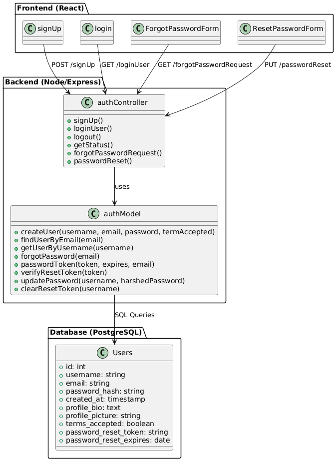

# Software Architecture Document

# Table of Contents
- [Introduction](#1-introduction)
    - [Purpose](#11-purpose)
    - [Scope](#12-scope)
    - [Definitions, Acronyms and Abbreviations](#13-definitions-acronyms-and-abbreviations)
    - [References](#14-references)
    - [Overview](#15-overview)
- [Architectural Representation](#2-architectural-representation)
- [Architectural Goals and Constraints](#3-architectural-goals-and-constraints)
- [Use-Case View](#4-use-case-view)
- [Logical View](#5-logical-view)
    - [Overview](#51-overview)
    - [Architecturally Significant Design Packages](#52-architecturally-significant-design-packages)
- [Process View](#6-process-view)
- [Deployment View](#7-deployment-view)
- [Implementation View](#8-implementation-view)
- [Data View](#9-data-view)
- [Size and Performance](#10-size-and-performance)
- [Quality](#11-quality)

## 1. Introduction

### 1.1 Purpose
This document provides a comprehensive architectural overview of the system, using a number of different architectural views to depict different aspects of the system. It is intended to capture and convey the significant architectural decisions which have been made on the system.

### 1.2 Scope
This document describes the technical architecture of the GluGuide project, including the structure of classes, modules and dependencies.

### 1.3 Definitions, Acronyms and Abbreviations

| Abbrevation | Description                            |
| ----------- | -------------------------------------- |
| API         | Application programming interface      |
| MVC         | Model View Controller                  |
| REST        | Representational state transfer        |
| SDK         | Software development kit               |
| SRS         | Software Requirements Specification    |
| UC          | Use Case                               |
| VCS         | Version Control System                 |
| n/a         | not applicable                         |

### 1.4 References

| Title                                                              | Date       | Publishing organization   |
| -------------------------------------------------------------------|:----------:| ------------------------- |
| [GluGuide Blog](https://gdewomenhealth.wordpress.com/?_gl=1%2Aowhejp%2A_gcl_au%2ANjg0NDgyODI1LjE3MjYxMzk0NDA)| 07.11.2024 |GluGuide  |
| [GitHub Repository](https://github.com/millisom/GluGuide)| 07.11.2024 |GluGuide  |
| [Overall Use Case Diagram](https://github.com/millisom/GluGuide/blob/108096264f95006fb383c2f643020956055fbe90/docs/UCD2.drawio.svg)| 07.11.2024 |GluGuide  |
| [SRS](SRS.md)| 07.11.2024 |GluGuide  |
| [UC:Create Account](UCCreateAccount.md)| 07.11.2024 |GluGuide  |
| [UC:Edit Account](UCEditAccount.md)| 07.11.2024 |GluGuide  |
| [UC:Delete Account](UCDeleteAccount.md)| 07.11.2024 |GluGuide  |
| [UC:Manage Blogpost](UCManagePost.md)| 07.11.2024 |GluGuide  |
| [UC:Manage Comments](UCManageComment.md)| 07.11.2024 |GluGuide  |
| [UC:Like Post](UCLikePost.md)| 16.11.2024 |GluGuide  |
| [UC:Like Comments](UCLikeDislikeComment.md)| 16.11.2024 |GluGuide  |

### 1.5 Overview
This document contains the Architectural Representation, Goals and Constraints as well
as the Logical, Deployment, Implementation and Data Views.

## 2. Architectural Representation
The back-end server uses Node.js + Express for REST APIs, front-end side is a React.js client with React Router and Axios. We follow the Model-View-Control.

  

In the backend we have folders for our 'model' and 'controller' files.

  

In our frontend we manage the 'view' with components implemented on pages.

  

## 3. Architectural Goals and Constraints
As mentioned in the second chapter, frontend and backend are using MVC pattern. This enables a clean software architecture with separate view, controller and model. 

### Front-end
React serves as the front-end framework. It manages the UI and consumes data via API calls

### Back-end
Node.js and Express provides the back-end framework, offering RESTful endpoints for the front-end to use.

The front-end and back-end are spearate but communicate via a REST API.
They are both written in Javascript. 

## 4. Use-Case View
Our overall UC diagram:

  

## 5. Logical View

### 5.1 Overview
The our project our elements are categorized by model, view and controller.
Data Flow:

  

1. User Interaction (view)
    A user interaction will trigger a function to handle the form submission.
2. Request Handling (Controller)
    The Controller receives the request, validates the data and passes it to the model.
3. Database Interaction (Model)
    Model interacts with our database and performes operations.
4. Response (Controller & View) 
    The Controller sends back the result (success or error), which is then handled by the view to update the user interface accordingly.

Generating an Architectural UML diagram for a JavaScript (JS) application are challenging because most UML tools and generators are geared toward object-oriented languages (like Java or C#) with strict class-based structures.
We've tried PlantUML and UML Generator in VSC but they didnt work.
In Intelij PlantUML works, but it does not automatically generate UML Diagrams, but we have to code Diagrams ourselfs.

[You can see our components here.](https://github.com/millisom/GluGuide/tree/9eb097c782f0119172f047879f77f3ddf21ca77b/gluGuideSetup/client/src/components)

This is the class diagram for the feature Authentification

  

This is the class diagram for the feature POST

  

This is the class diagram for the feature Comment

  

This is the class diagram for the feature Profile

  

### 5.2 Architecturally Significant Design Packages
- Multer (File Upload Middleware)
- Quill (Text Editor)
- Axios (HTTP Client)
- Vite (Deployment performance)

These can be considered architectually significant.

## 6. Process View
        
n/a

## 7. Deployment View

Our Deployment setup includes a client and a server. 

            ┌─────────────────────────────────────┐
            │                                     │
            │          React Frontend             │
            │              Client                 │
            │                                     │
            └────────────────┬────────────────────┘
                             │
                             │
       ┌─────────────────────▼─────────────────────┐
       │                                           │
       │       Node.js + Express Backend           │
       │                  Server                   │
       │                                           │
       └─────────────────────┬─────────────────────┘
                             │
                             │
                             ▼
                 ┌──────────────────────┐
                 │Database (PostgreSQL) │
                 │                      │
                 └──────────────────────┘

## 9. Data View
Our database structure in a schema:

  

## 10. Size and Performance
n/a

## 11. Quality/Metrics

n/a
