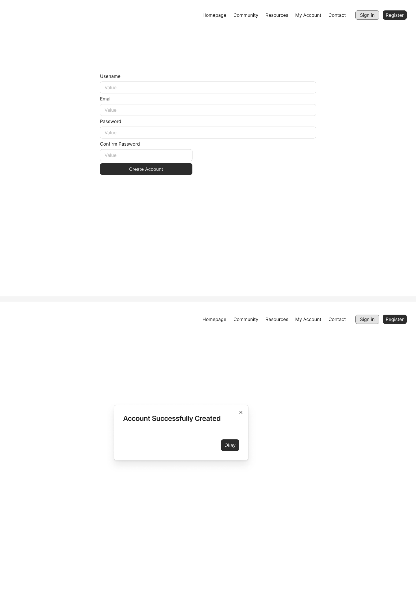

# 1 Use-Case Name
Create Account

## 1.1 Brief Description
A user can create a new account to access the web application. During account creation, the user provides essential information such as:

- **Username**
- **Email**
- **Password**
- (Optional) **Confirm Password**

The system validates the input, stores the user's information, and may require email verification. After successful account creation, the user is either logged in automatically or prompted to log in.

## 2. Basic Flow
1. The user navigates to the registration page.
2. The user fills in the following fields:
   - Email
   - Password
   - Username
3. User can click "Cancel" to exit the form without creating an account.
4. The user submits the form by clicking the "Create Account" button.
5. The system validates the user's input:
   - Ensures the email format is valid.
   - Checks that the password meets strength requirements.
   - Ensures that the username is unique and available.
6. If validation is successful, the system stores the user's account information in the database.
7. The system confirms the account creation by showing a success message.
8. (Optional) The system sends a verification email to the user's email address.
9. (Optional) The user is either logged in automatically or redirected to the login page.

### 2.1 Activity Diagram


### 2.2 Mock-up


### 2.3 Alternate Flow:
- **Invalid Input:**
   - If the user provides an invalid email or weak password, the system displays an error message and asks the user to correct the form.
- **Duplicate Email/Username:**
   - If the email or username already exists, the system prompts the user to choose a different one.

### 2.4 Narrative
```gherkin
Feature: Account creation

  As a visitor to the site
  I want to create a new account
  In order to access the application's features

  Background:
    Given I am on the homepage

  Scenario: Open account creation page
    Given I am on the homepage
    When I click the "Register" button
    Then I am redirected to the "Create Account" page

  Scenario: Enter valid data and create an account
    Given I am on the "Create Account" page
    When I enter "myusername" in the "Username" field
    And I enter "myemail@example.com" in the "Email" field
    And I enter "mypassword" in the "Password" field
    And I press the "Create Account" button
    Then I am redirected to the "My Account" page
    And I receive a "Success" message

  Scenario: Enter invalid data and receive error message
    Given I am on the "Create Account" page
    When I enter "myusername" in the "Username" field
    And I enter "invalid-email" in the "Email" field
    And I enter "short" in the "Password" field
    And I press the "Create Account" button
    Then I remain on the "Create Account" page
    And I receive an "Error" message
```

## 3. Preconditions:
- The user is on the registration page.
- The user is not logged in.
- The registration page is accessible and connected to the backend services.

## 4. Postconditions:
- A new user account is successfully created and saved in the database.
- (Optional) The user is sent a verification email.
- The user may be logged in automatically or prompted to log in.

## 5. Exceptions:
- **System Failure**: If the system encounters an issue during account creation (e.g., server is down), it informs the user to try again later.

## 6. Link to SRS:
This use case is linked to the relevant section of the [Software Requirements Specification (SRS)](SRS.md).

## 7. CRUD Classification:
- **Create**: This use case represents the **Create** operation in CRUD as it handles the creation of a new user account.

