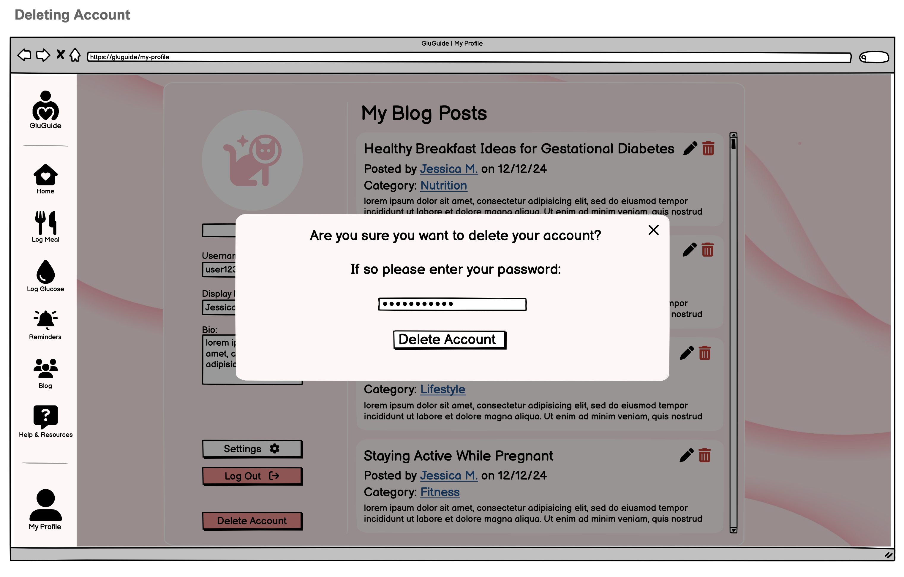

# Use-Case Specification: Delete Account | Version 1.0

## 1. Use-Case: Delete Account  
### 1.1 Brief Description  
This use case describes the process through which a user can permanently delete their account from GluGuide, removing all associated data and access.

---

## 2. Flow of Events

### 2.1 Basic Flow  
The user navigates to the account and selects the option to delete their account. The system will ask for confirmation and a password before permanently deleting the account and all associated data.

---

### 2.2 Deletion Process  
1. The user selects **Delete Account** button in their profile.
2. A confirmation message is displayed, asking if the user is sure that they want to delete their account.
3. The user must enter their password and confirm deletion.
4. Once confirmed, the account and all data are deleted, and the user is logged out.

---

### 2.3 Confirmation Modal  
To prevent accidental deletion, a modal window will appear with a clear question if the user is sure they want to delete their account, and the action cannot be undone.

---

### Mock up  

---

## 3. Special Requirements

### 3.1 Account Ownership  
Only the authenticated user can delete their own account. Deletion should not be possible without proper authentication.

---

## 4. Preconditions

### 4.1 User Must Be Logged In  
The user must be logged in to delete their account, ensuring that only the account owner can take this action.

---

## 5. Postconditions

### 5.1 Successful Deletion  
Once the account is deleted, the user will no longer have access to GluGuide, and all personal data will be permanently erased.

### 5.2 Redirection  
After deletion, the user will be logged out and redirected to the homepage or a "Goodbye" screen.

---
