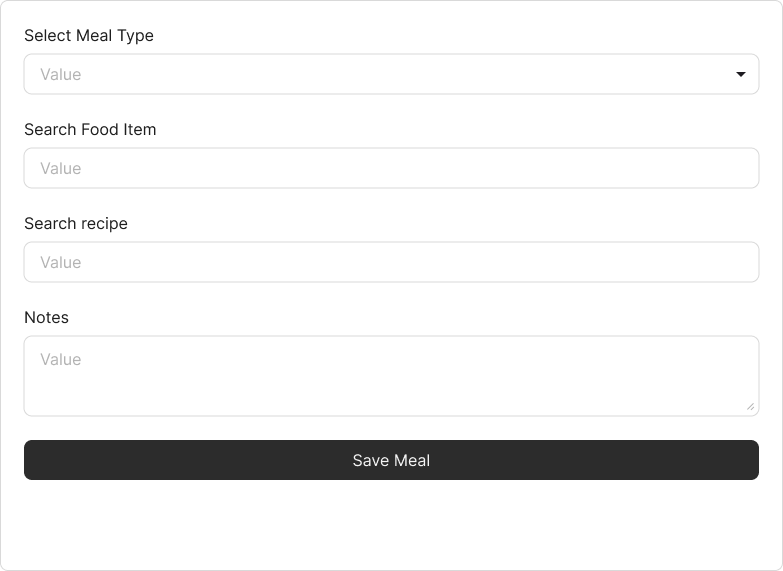
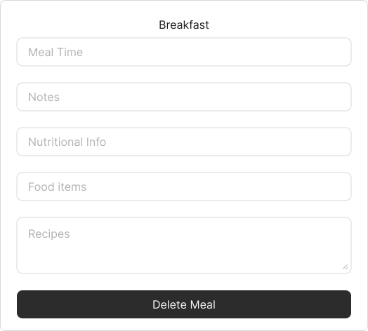
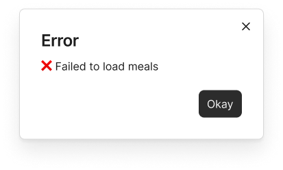

# Use-Case Specification: Log Meal

## 1. Use-Case: Log Meal

### 1.1 Brief Description

This use case describes the process where users can log their meals by entering food items or recipes and view details of their logged meals including nutritional information.

---

## 2. Basic Flow

### 2.1 Log a Meal

1. The user navigates to the **Log Meal Page**.
2. The user selects a **meal type** from the dropdown.
3. The user optionally enters **notes** for the meal.
4. The user optionally selects a **recipe** using the Recipe Selector.
5. The user adds individual **food items**.
6. The user sees a live **Meal Preview** of items and recipe.
7. The user clicks **Save Meal**.
8. The system sends a **POST request** to save the meal.
9. The system triggers **macros recalculation** for the meal.
10. On success, the system redirects the user to the **Meal Card View**, which is the Meal Summary.

### 2.2 View Meals Overview

1. The user navigates to the **Meals Overview Page**.
2. The system fetches all meals using the API.
3. Each meal is shown in a summary card.
4. The user clicks **View Meal** on any card to see its details.

### 2.3 View Meal Details

1. The user lands on the **MealCardRoute**, which is again the Summary Page of the specific Meal.
2. The system fetches the full meal object.
3. The user sees detailed info: meal type, time, notes, food items, recipes, and macros.
4. The user can **delete the meal** if desired.

---

### 2.4 Activity Diagram


---

### 2.5 Mock-up

#### 2.5.1 Log Meal



#### 2.5.2 Summary



#### 2.5.3 Error



---

## 3. Alternate Flows

* **No Meal Type Selected**

  * The system shows: `"Please select a meal type"` and blocks submission.

* **API Failure During Save**

  * The system shows: `"Error saving meal"`.

* **API Failure During Fetch**

  * If meals cannot be loaded: `"❌ Failed to load meals."`
  * If one meal cannot be loaded: `"❌ Failed to load meal."`

* **Invalid or Deleted Meal ID**

  * The system shows: `"Meal not found or deleted."`

---

## 4. Narrative

```gherkin
Feature: Log and View Meal
  As a user
  I want to log meals and view them later
  So that I can track my nutritional intake

  Scenario: Successfully log a meal
    Given I am on the Log Meal Page
    When I select a meal type, add food items, and click Save Meal
    Then the system stores the meal
    And redirects me to the Meal Detail View

  Scenario: View all meals
    Given I am on the Meals Overview Page
    When I load the page
    Then I see all my saved meals in cards

  Scenario: View details of a specific meal
    Given I have saved meals
    When I click on View Meal
    Then I see the meal details including notes, time, and nutrition

  Scenario: Delete a meal
    Given I am viewing a meal
    When I click Delete Meal
    Then the system removes the meal from the database
```

---

## 5. Preconditions

### 5.1 User Access

The user must be authenticated and authorized to access meal logging features.

### 5.2 Network and Server

API services for create, fetch, and delete must be available.

### 5.3 Client-Side Requirements

* Valid meal type must be selected.
* If recipe or food items are added, data must be valid.
* JavaScript and API endpoints must be functional.

---

## 6. Postconditions

### 6.1 Meal Storage

* Meals are saved to the database.
* Food items and recipes are recorded.

### 6.2 User Feedback

* Success or error messages are displayed.
* The user is redirected to the correct view.

### 6.3 Meal Macros

* Nutritional macros (calories, carbs, proteins, fats) are calculated and stored.

---

## 7. Exceptions

### 7.1 API Unreachable

* The frontend shows a relevant error message.

### 7.2 Meal Not Found

* Displays an error for non-existent or deleted meal ID.

---

## 8. Link to SRS

This use case is linked to the relevant section of the [Software Requirements Specification (SRS)](SRS.md).

---

## 9. CRUD Classification

### 9.1 Create and Read Operation

This use case falls under **CREATE** and **READ** operations in CRUD.

* Create: When a new meal is logged.
* Read: When meals are displayed in overview or detailed views.
