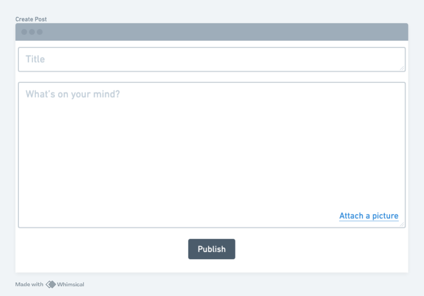
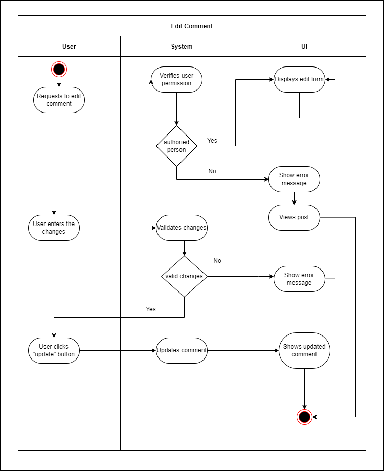
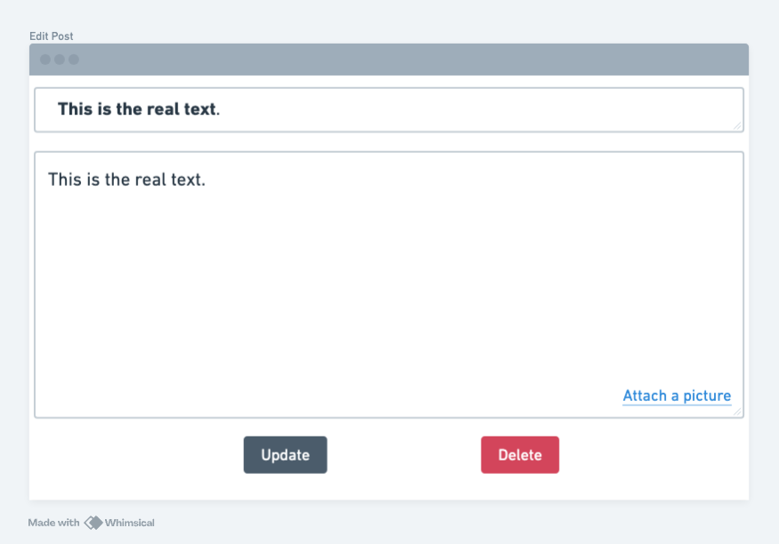
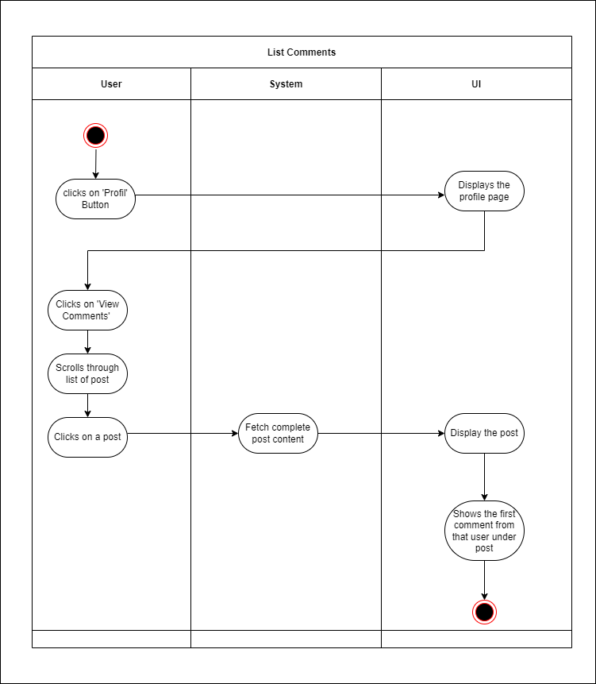
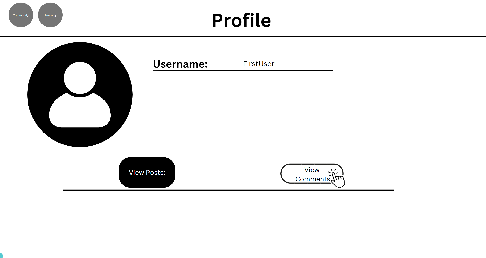
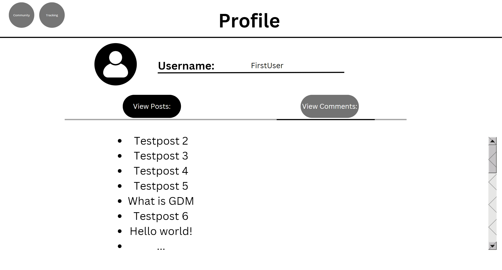
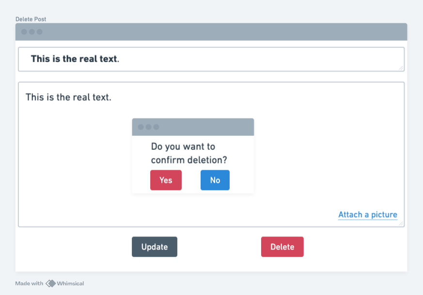

# Use-Case Specification: Manage Comment | Version 1.1

## 1. Use-Case: Manage Comment  
### 1.1 Brief Description  
This use case describes the creation, reading, updating, and deleting of comments (CRUD) in the system.

---

## 2. Flow of Events  

### 2.1 Basic Flow  
In general, a user will open a post, view all comments, write a comment, edit or delete a self written comment.

### 2.2 Creation  
The creation of a new comment. The user must opened a post to write a comment.

### 2.3 Edit  
During editing, the user can modify the content of the comment.

### 2.4 List  
The user wants to be able to view all posts with their comments. Therefore, the system presents a list with all entries.

### 2.5 Delete  
The user can delete a self written comment. There is a button in the edit view to delete the comment. To ensure the user does not accidentally delete a comment, we added a modal asking for confirmation.

---

## 3. Special Requirements

### 3.1 Owning an Account  
In order to create, edit, or delete a comment, the user must have an account. Only if the user is authenticated, the dialog for commenting a posts will be visible.

---

## 4. Preconditions

### 4.1 The user has to be logged in  
To ensure proper privacy and security, the user must be logged in when managing comments.

---

## 5. Postconditions

### 5.1 Create  
After creating a new comment, the user will leave the edit view and see the post with all comments underneath.

### 5.2 Edit  
After the user saves their edits, the updated comment will be displayed under the post.

### 5.3 List  
When the user requests to list all comments, the system will fetch and display all existing posts with comments from this user in a paginated or scrollable format.

### 5.4 Delete  
After confirming the deletion in the pop up window that is shown, the comment will be permanently removed and no longer displayed under the post and in the list overview.
