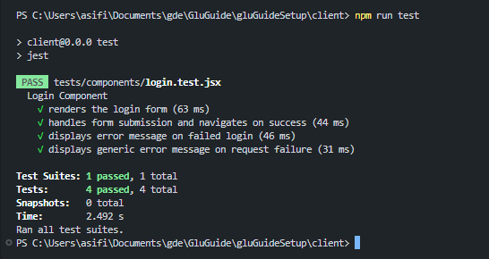
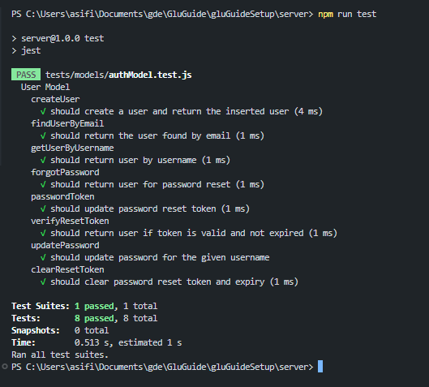
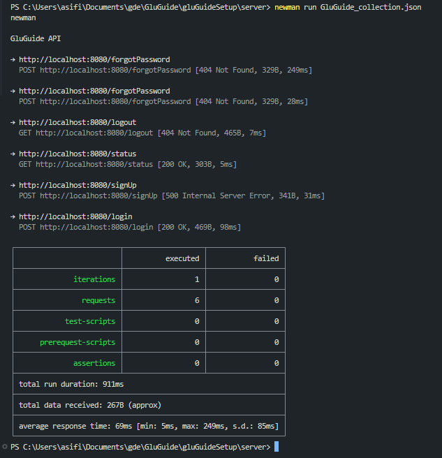

# Set Up

This project is a Vite-based React frontend with an Express.js backend with MVC pattern.

## Technologies Used
- **Frontend**: React, Vite
- **Backend**: Node.js, Express.js, PostgreSQL
- **Database**: PostgreSQL
- **Testing**: Jest, React Testing Library, Cucumber and Selenium, Postman
- **Version Control**: Git, GitHub

## Prerequisites

Make sure you have the following installed:

- [Node.js](https://nodejs.org/en/) (which includes npm)

## App

### Setting up dependencies

#### 1. Install required plugins for the frontend client

Navigate to the `/client` folder and run the following command:

```bash
npm install
```

This will generate the `/node_modules` folder with all necessary plugins used in this project.

#### 2. Install required plugins for the server

After Step 1 is done, return to the `/gluGuideSetup` folder and navigate to `/server` to do the same thing, but for the backend, running the same command:

```bash
npm install
```

### Environment Configuration

This project uses environment variables to manage sensitive configuration details such as database credentials and session secrets. For security reasons, these details are stored in a `.env` file located in the `/server` directory and are intentionally excluded from GitHub.

Before running the project, please create your own `.env` file in the `/server` directory using the following template:

```
PGHOST=your_database_host
PGUSER=your_database_user
PGPASSWORD=your_database_password
PGDATABASE=your_database_name
PGPORT=your_database_port
SESSION_SECRET=your_session_secret
```

**Note:** To have access to our database, please contact our group and we will provide you with the necessary credentials.

### Starting the application

If you just want to use the App, simply navigate to the `/client` folder, then start it using:

```bash
npm start
```

If you wish to also work on the server, navigate to the `/server` folder and use the same command.

The server will be running on http://localhost:8080 by default.
And the client will be running on http://localhost:5173 by default.

## Testing
To check why is the particular test stack chosen, please refer to the [TestingDoc.md](../TestingDoc.md) file.
### Frontend Testing
Create a test file in the `/client/src` folder. The test files should be named with a `.test.jsx` extension.
To run the frontend tests, navigate to the `/client` folder and run the tests by running the following commands:

```bash
cd client
npm run test
```
This will execute the tests using Jest and React Testing Library.  
Results should look like this:  


### Backend Testing
Create a test file inside the corresponding MVC subfolder under  `/server/tests/` folder. The test files should be named with a `.test.js` extension.
To run the backend tests, navigate to the `/server` folder and run the tests by running the following commands:

```bash
cd server
npm run test
```
This will execute the tests using Jest.  
Results should look like this:  


### End-to-End Testing
A complete guide can be found in the [Cucumber+Selenium.md](../featureFiles/Cucumber+Selenium.md).
To implement end-to-end tests using Cucumber.js, follow these steps:
1. Create a .feature file in the `/tests/features` folder. The feature files should be named with a `.feature` extension.
2. Create a corresponding step definition file in the `/test/features/step_definitions` folder. The step definition files should be named with a `.js` extension.
3. To run the end-to-end tests, navigate to the `/test` folder and run the tests by running the following commands:

```bash
cd test
npm test
```
This will execute the end-to-end tests using Cucumber.js.
To see the results and the complete guide please refer to the [Cucumber+Selenium.md](../featureFiles/Cucumber+Selenium.md) file.


### 'Automating' API Testing with Postman
1. Install Postman from the [official website](https://www.postman.com/downloads/).
2. Open Postman and create new collection.
3. Add requests to the collection for each API endpoint you want to test.
4. Set the request method (GET, POST, PUT, DELETE) and enter the URL for the API endpoint.
5. Add any required headers, parameters, or request body as needed.
6. Click the "Send" button to send the request and view the response.
7. You can also add tests to each request to validate the response. Postman allows you to write JavaScript code to check the response status, headers, and body.
8. Save your collection by exporting the collection as a JSON file. This will allow you import it into your codebase and automate the testing process.
9. To run the collection, you can use the Postman CLI tool called Newman. Install Newman globally using npm:

```bash
npm install -g newman
```
10. Run the collection using Newman by executing the following command in your terminal:

```bash
newman run newman run path/to/GluGuide_collection.json
```
This will execute all the requests in the collection and display the results in the terminal.  
Results should look like this:  


## Github

#### 1. Clone the repository

To get a copy of the project, run the following command:

```bash
git clone https://github.com/millisom/GluGuide.git
```

#### 2. Update to the Main Branch

Before making any changes, always ensure you are working on the latest version of the main branch:

```bash
git checkout main
git pull origin main
```

#### 3. Create a New Branch

To start working on a new feature or issue, create a new branch:

```bash
git checkout -b your-feature-branch
```

Replace your-feature-branch with a meaningful name for your new branch (e.g., feature/add-login-page).

#### 4. Push Changes to GitHub

After committing your changes locally, push your branch to GitHub:

```bash
git add .
git commit -m "Your descriptive commit message"
git push origin your-feature-branch
```

#### 5. Pull Requests

Once your work is complete, create a pull request to merge your changes into the main branch:

```bash
git checkout main
git pull origin main
git merge your-feature-branch
```

Push the changes to the main branch:

```bash
git push origin main
```

## Troubleshooting

If you run into any issues while running or developing the project, try the following steps:

#### Environment Variables Not Loaded:

Make sure you’ve created the `.env` file in the `/server` directory with all the required variables. If the application can’t connect to the database or is missing configurations, check that your environment is properly loading the `.env` file.

#### Database Connection Problems:

If you experience issues connecting to the PostgreSQL database, double-check the credentials in your `.env` file. Ensure that the database server is reachable and the credentials are up-to-date. If you are using creditials provided by our team, please feel free to contact us.

#### Dependency Issues:

Errors related to missing modules or packages can often be resolved by reinstalling dependencies. Run the appropriate command (`npm install`) to ensure everything is correctly installed. It also helps to delete the `/node_modules` folder beforehand, as it will be regenerated by the install command anyways.

#### Application Startup Errors:

If the app crashes or fails to start, review the error messages in your terminal or log files. These messages usually provide hints about what’s wrong. Sometimes, simply restarting the development server or clearing the cache can help. Should there be any errors related to functionality, please contact us so we can have a look at it and deploy a bug fix.

#### Frontend Build or Rendering Issues:

Should you encounter issues with the frontend (such as missing assets or rendering problems), confirm that the build process completed successfully and check your browser’s console for error messages that might indicate what went wrong.

If these steps don’t resolve the issue, try to isolate the problem by checking recent changes in the code, and consider reaching out to use for more assistance.
